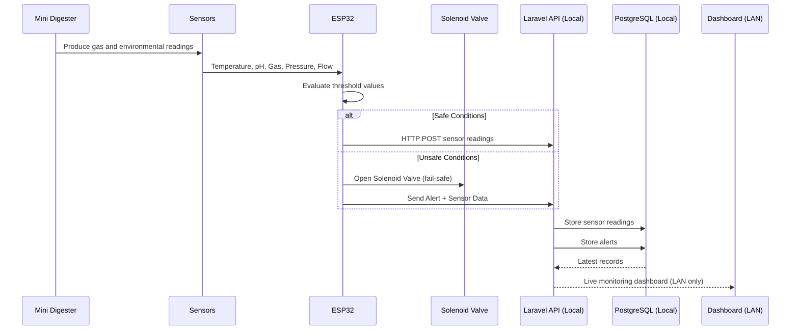

# SULO Complete System Manual
## Smart Utility for Local Organic Waste
### Hardware + Software Reference Guide

---

> **SULO** is a fully local, offline-capable biogas digester monitoring system. It monitors digester conditions in real-time using ESP32-connected sensors, displays readings on an OLED screen, communicates with a local server over WiFi, and provides a web dashboard accessible from any device on the same network. No internet required.

---

# Table of Contents

1. [How the System Works](#1-how-the-system-works)
2. [System Architecture](#2-system-architecture)
3. [Hardware Bill of Materials](#3-hardware-bill-of-materials)
4. [Hardware Setup — Wiring & Assembly](#4-hardware-setup)
5. [Software Overview](#5-software-overview)
6. [Server Setup — Raspberry Pi](#6-server-setup)
7. [Firmware Setup — ESP32](#7-firmware-setup)
8. [Configuration Reference](#8-configuration-reference)
9. [How the Data Flows — End to End](#9-how-the-data-flows)
10. [OLED Display — Reading the Screens](#10-oled-display)
11. [IR Remote Control](#11-ir-remote-control)
12. [Web Dashboard — Live Monitoring](#12-web-dashboard)
13. [Fail-Safe System — Solenoid Valve](#13-fail-safe-system)
14. [Database Design](#14-database-design)
15. [API Reference](#15-api-reference)
16. [Troubleshooting](#16-troubleshooting)
17. [Maintenance Schedule](#17-maintenance-schedule)
18. [Safety Guidelines](#18-safety-guidelines)
19. [Project File Structure](#19-project-file-structure)

---

# 1. How the System Works

SULO operates in a continuous loop. Here is what happens from power-on:

| Step | What Happens | Where |
|------|-------------|-------|
| 1. Power On | ESP32 boots, connects to WiFi, connects to local server | ESP32 |
| 2. Read Sensors | Every 10 seconds, ESP32 reads temperature, pH, gas, pressure, flow | ESP32 |
| 3. Evaluate Thresholds | Firmware compares each reading against safe ranges | ESP32 |
| 4. Update Display | OLED refreshes with current values and status (Normal/Warning/Critical) | ESP32 |
| 5. Send Data | ESP32 sends sensor readings as JSON via HTTP POST to local server | WiFi LAN |
| 6. Check Fail-Safe | If pressure > 200 kPa, solenoid valve opens immediately | ESP32 + Relay |
| 7. Handle Remote | IR remote buttons navigate display screens, silence alerts | ESP32 |
| 8. Store Data | Server saves readings and alerts to PostgreSQL database | Raspberry Pi |
| 9. Update Dashboard | Any device on the same WiFi sees live data at http://192.168.4.1:8000 | Any browser |
| 10. Repeat | Steps 2-9 loop continuously while the system is powered | All |

**Key design decision:** The system requires NO internet connection. The ESP32 talks to the Raspberry Pi over local WiFi only. The dashboard is accessed via the Pi's local IP address.

---

# 2. System Architecture

## 2.1 Two-Layer Design

```
+=================================================================+
|                    LOCAL WIFI NETWORK (LAN)                      |
|                   No Internet Required                           |
|                                                                  |
|   EDGE LAYER (On-Site Hardware)     LOCAL LAYER (Server)        |
|   +---------------------------+     +------------------------+  |
|   |                           |     |                        |  |
|   |   [Sensors]               |     |   [Laravel API]        |  |
|   |    DS18B20 (Temp)         |     |                        |  |
|   |    pH Sensor              |     |   [PostgreSQL DB]      |  |
|   |    MQ-4 (Gas)             |     |                        |  |
|   |    BMP280 (Pressure)      |     |   [Web Dashboard]      |  |
|   |    YF-S401 (Flow)         |     |                        |  |
|   |        |                  |     |   Raspberry Pi 4/5     |  |
|   |        v                  |     |                        |  |
|   |   [ESP32] ────WiFi────>  HTTP  |   localhost:8000        |  |
|   |        |                  POST  |                        |  |
|   |        v                  ───>  +------------------------+  |
|   |   [OLED Display]               |        ^                  |
|   |   [IR Remote]                  |        |                  |
|   |   [Relay + Solenoid Valve]     |   Any device on LAN      |
|   |                                |   (phone/laptop/PC)      |
|   +---------------------------+     +------------------------+  |
+=================================================================+
```

## 2.2 Data Flow Diagram



## 2.3 Network Topology

```
+-----------------------------------------------------+
|                 Local WiFi Network (LAN)            |
|                  No Internet Required                |
|                                                     |
|   +----------+    HTTP POST     +----------------+  |
|   |  ESP32   | ------------->  |  Raspberry Pi  |  |
|   |  (Edge)  |    JSON data    |  (Local Server)|  |
|   +----------+                  |                |  |
|        ^                        |  Laravel API   |  |
|   Sensors +                    |  PostgreSQL    |  |
|   Display +                    |  Web Dashboard |  |
|   Valve +                      +----------------+  |
|   IR Remote                         ^               |
|                                 Dashboard            |
|                              (any LAN device)        |
+-----------------------------------------------------+
```

---

# 3. Hardware Bill of Materials

| Component | Model | Purpose | Connection |
|-----------|-------|---------|------------|
| Microcontroller | ESP32 DevKit V1 | Central processor, WiFi, sensor I/O | USB / 5V |
| Temperature Sensor | DS18B20 (waterproof) | Digester temperature | GPIO 4 (OneWire) |
| pH Sensor | Analog pH Kit (BNC) | Acid-alkaline balance | GPIO 34 (Analog) |
| Gas Sensor | MQ-4 or MQ-135 | Methane / biogas detection | GPIO 35 (Analog) |
| Pressure Sensor | BMP280 | Digester internal pressure | GPIO 21/22 (I2C) |
| Flow Sensor | YF-S401 (half-inch) | Gas output flow rate | GPIO 25 (Interrupt) |
| Display | SSD1306 OLED 128x64 | On-site status display | GPIO 21/22 (I2C) |
| IR Receiver | VS1838B | Screen navigation | GPIO 15 |
| IR Remote | Any NEC protocol | Operator input | Wireless |
| Relay Module | 5V 1-channel | Solenoid valve control | GPIO 26 |
| Solenoid Valve | 12V normally-closed | Overpressure relief | Relay |
| Server | Raspberry Pi 4/5 (4GB+) | API + Database + Dashboard | WiFi |
| WiFi Router | Any | Creates local network | Ethernet/WiFi |

**Estimated cost:** PHP 3,000 - 5,000 for all components

---

# 4. Hardware Setup

## 4.1 ESP32 Pin Assignments

| Pin | Component | Type | Notes |
|-----|-----------|------|-------|
| GPIO 4 | DS18B20 | Digital | OneWire bus, needs 4.7k pull-up resistor |
| GPIO 34 | pH Sensor | Analog (Input only) | 0-3.3V, use voltage divider if 5V sensor |
| GPIO 35 | Gas Sensor | Analog (Input only) | 0-3.3V, use voltage divider if 5V sensor |
| GPIO 21 | I2C SDA | I2C Data | Shared by OLED and BMP280 |
| GPIO 22 | I2C SCL | I2C Clock | Shared by OLED and BMP280 |
| GPIO 25 | Flow Sensor | Digital (Interrupt) | Counts pulses for flow rate |
| GPIO 15 | IR Receiver | Digital Input | IR remote signals |
| GPIO 26 | Relay | Digital Output | Controls solenoid valve |

## 4.2 Wiring Diagrams

### I2C Bus (OLED + BMP280 share the same bus)
```
ESP32 GPIO 21 (SDA) ----+---- OLED SDA (pin 4)
           

---

# 8. Configuration Reference

All settings are in `firmware/config.h`:

## WiFi Settings
```
WIFI_SSID       "YourNetworkName"
WIFI_PASSWORD   "YourPassword"
WIFI_TIMEOUT_MS 15000
```

## Server Settings
```
SERVER_HOST     "192.168.4.1"
SERVER_PORT     8000
```

## Sensor Thresholds
```
TEMP_MIN_C          25.0f     Min safe temperature (C)
TEMP_MAX_C          55.0f     Max safe temperature (C)
PH_MIN              6.0f      Min safe pH
PH_MAX              8.5f      Max safe pH
GAS_MAX_PPM         5000.0f   Max safe gas level (ppm)
PRESSURE_MAX_KPA    200.0f    Critical: valve opens
PRESSURE_ALERT_KPA  180.0f    Warning threshold
```

## Timing Intervals
```
SENSOR_POLL_INTERVAL    10000  Read sensors every 10s
DISPLAY_REFRESH_INTERVAL 1000  Update display every 1s
SERVER_POST_INTERVAL    15000  Send data every 15s
```

## Pin Assignments
```
TEMP_SENSOR_PIN     4      DS18B20
PH_SENSOR_PIN       34     pH analog
GAS_SENSOR_PIN      35     Gas analog
PRESSURE_SENSOR_SDA 21     BMP280 I2C
PRESSURE_SENSOR_SCL 22     BMP280 I2C
FLOW_SENSOR_PIN     25     Flow interrupt
IR_RECEIVER_PIN     15     IR remote
RELAY_PIN           26     Solenoid valve
DISPLAY_SDA         21     OLED I2C (shared)
DISPLAY_SCL         22     OLED I2C (shared)
```

---

# 9. How the Data Flows

## From Sensor to Dashboard

```
DS18B20 ----[OneWire]----> ESP32 ----[HTTP POST]----> Raspberry Pi ----> PostgreSQL
pH Sensor --[Analog]-----> ESP32 ----[JSON]---------> Laravel API ----> Dashboard
MQ-4 ------[Analog]-----> ESP32                          |
BMP280 ----[I2C]--------> ESP32                     [stored in DB]
YF-S401 ---[Interrupt]--> ESP32                          |
                                                        v
OLED <----[I2C]--------- ESP32                     Web Dashboard
Relay <---[GPIO]-------- ESP32                     (any LAN device)
```

## Data Format (HTTP POST)

The ESP32 sends this JSON to the server every 15 seconds:
```json
{
    "temperature": 38.5,
    "ph": 7.20,
    "gas_level": 1800.0,
    "pressure": 120.0,
    "flow_rate": 2.40,
    "status": 0,
    "valve_open": false
}
```

## Status Codes

| Code | Status | Dashboard Color |
|------|--------|----------------|
| 0 | Normal | Green |
| 1 | Warning | Yellow |
| 2 | Critical | Red |

---

# 10. OLED Display

## Screen Map

| Screen # | Name | Content |
|----------|------|---------|
| 0 | Overview | All 5 sensor values at once |
| 1 | Temperature | Large temperature + safe range |
| 2 | pH | Large pH value + safe range |
| 3 | Gas | Large gas level + max safe value |
| 4 | Pressure | Large pressure + valve status |
| 5 | Alerts | List of active alert conditions |

## Example: Overview Screen

```
SULO | Overview          [NORMAL]

Temp:  38.5 C
pH:    7.20
Gas:   1800 ppm
Press: 120.0 kPa
Flow:  2.40 L/m
```

## Status Indicators

- **[NORMAL]** — All readings within safe range
- **[WARNING]** — One or more readings approaching thresholds
- **[CRITICAL]** — One or more readings outside safe range

---

# 11. IR Remote Control

## Supported Buttons

| Button | Function |
|--------|----------|
| Next (>>|) | Next display screen |
| Previous (|<<) | Previous display screen |
| Power | Return to Overview screen |
| Mute | Silence alert display |

## Customizing Button Codes

Default codes are for common NEC remotes. To use a different remote:

1. Flash an IR receiver test sketch to find your button codes
2. Update the defines in `ESP32.ino`:
```cpp
#define IR_BTN_NEXT     0xFFC23D
#define IR_BTN_PREV     0xFF22DD
#define IR_BTN_MUTE     0xFFA25D
#define IR_BTN_POWER    0xFFE01F
```

---

# 12. Web Dashboard

## Accessing

Connect any device (phone, laptop, PC) to the same WiFi network, open a browser, go to:

```
http://192.168.4.1:8000
```

## Dashboard Sections

### Header
- SULO project title
- Connection status ("Connected to LAN" or "Server unreachable")
- Overall status badge (Normal / Warning / Critical)

### Live Sensor Cards (6 cards)
- Temperature (C)
- pH Level
- Gas Level (ppm)
- Pressure (kPa)
- Flow Rate (L/min)
- Solenoid Valve status (CLOSED / OPEN)

### Historical Charts
- Temperature & Pressure (24-hour dual Y-axis chart)
- pH & Gas Level (24-hour dual Y-axis chart)

### Alert Log
- Time of occurrence
- Alert type (overpressure, threshold_breach)
- Severity (WARNING, CRITICAL)
- Message description
- Acknowledged status

## Auto-Refresh

The dashboard automatically updates every 5 seconds. No manual refresh needed.

## Offline Operation

Chart.js is bundled locally at `public/js/chart.umd.min.js`. The dashboard works entirely offline — no CDN or internet needed.

---

# 13. Fail-Safe System

## Trigger Conditions

1. **Overpressure (>200 kPa)** — Solenoid valve opens IMMEDIATELY
2. **Pressure stays high** — Valve stays open
3. **Pressure drops below 170 kPa** — Valve closes

## How It Works

```
Pressure > 200 kPa detected
        |
        v
ESP32 GPIO 26 goes HIGH
        |
        v
Relay module activates
        |
        v
Solenoid valve OPENS
        |
        v
Gas vents to atmosphere
        |
        v
Pressure drops below 170 kPa
        |
        v
ESP32 GPIO 26 goes LOW
        |
        v
Solenoid valve CLOSES
```

## Key Points

- Fail-safe operates INDEPENDENTLY of WiFi and server
- Even if WiFi is down, the valve still opens on overpressure
- Never disable the fail-safe in production
- Keep the solenoid valve accessible for manual override
- Test with valve disconnected from gas lines first

---

# 14. Database Design

## Tables

### sensor_readings
| Column | Type | Description |
|--------|------|-------------|
| reading_id | INT (PK) | Auto-increment ID |
| temperature | DECIMAL(6,2) | Celsius |
| ph | DECIMAL(4,2) | pH level |
| gas_level | DECIMAL(8,2) | ppm |
| pressure | DECIMAL(6,2) | kPa |
| flow_rate | DECIMAL(8,4) | L/min |
| status | TINYINT | 0=normal, 1=warning, 2=critical |
| valve_open | BOOLEAN | Solenoid valve state |
| recorded_at | TIMESTAMP | When reading was taken |

### alerts
| Column | Type | Description |
|--------|------|-------------|
| alert_id | INT (PK) | Auto-increment ID |
| reading_id | INT (FK) | Links to sensor_readings |
| alert_type | VARCHAR | overpressure, threshold_breach |
| severity | VARCHAR | warning, critical |
| message | TEXT | Alert description |
| acknowledged | BOOLEAN | Whether operator acknowledged |
| created_at | TIMESTAMP | When alert was created |

### digester_status
| Column | Type | Description |
|--------|------|-------------|
| status_id | INT (PK) | Always 1 (single row) |
| reading_id | INT (FK) | Latest reading |
| valve_status | VARCHAR | open, closed |
| overall_status | VARCHAR | Normal, Warning, Critical |
| updated_at | TIMESTAMP | Last update time |

---

# 15. API Reference

| Method | Endpoint | Description |
|--------|----------|-------------|
| POST | /api/readings | ESP32 sends sensor data |
| POST | /api/alerts | ESP32 sends alert event |
| GET | /api/readings | Dashboard: paginated readings |
| GET | /api/readings/latest | Dashboard: most recent reading |
| GET | /api/readings/history?hours=24 | Dashboard: hourly averages |
| GET | /api/alerts | Dashboard: alert log |
| PATCH | /api/alerts/{id}/acknowledge | Mark alert acknowledged |
| GET | /api/status | Dashboard: current status |
| DELETE | /api/readings/prune?days=90 | Cleanup old data |

---

# 16. Troubleshooting

| Problem | Possible Cause | Solution |
|---------|---------------|----------|
| ESP32 won't connect WiFi | Wrong SSID/password | Check config.h credentials |
| No serial output | USB not connected | Check USB cable and port |
| Temperature shows -127 | DS18B20 not connected | Check GPIO 4 wiring |
| pH always 0 or 14 | Analog wiring issue | Check GPIO 34 connection |
| Gas always 0 | Sensor not warmed up | Wait 48 hours for first use |
| Pressure shows 0 | BMP280 not found | Check I2C address 0x76 |
| Flow always 0 | Interrupt not working | Check GPIO 25 wiring |
| OLED blank | Wrong I2C address | Verify address 0x3C |
| Dashboard won't load | Nginx not running | Restart nginx service |
| "Server unreachable" | Pi offline | Check Pi power and network |
| API returns 500 | Database error | Check PostgreSQL status |
| IR remote not working | Wrong codes | Check Serial Monitor for codes |
| Charts blank | Chart.js not downloaded | Run setup script again |

---

# 17. Maintenance Schedule

## Weekly
- Check dashboard for any alerts
- Verify all sensor readings are reasonable

## Monthly
- Calibrate pH sensor with buffer solutions (pH 4.0 and 7.0)
- Clean gas sensor surface
- Test solenoid valve operation manually

## Database Cleanup

Delete readings older than 90 days:
```bash
curl -X DELETE "http://localhost:8000/api/readings/prune?days=90"
```

## Database Backup

```bash
pg_dump -U sulo_user sulo > ~/backups/sulo_$(date +%Y%m%d).sql
```

---

# 18. Safety Guidelines

1. **Never disable the fail-safe system** in production
2. **Keep solenoid valve accessible** for manual override
3. **Use waterproof sensors** for digester submersion
4. **Keep electronics away from water and gas** (sealed enclosures)
5. **Biogas is flammable** — ensure proper ventilation
6. **Never block the relief valve** — prevents pressure buildup
7. **Use proper wiring** — no exposed connections near gas

## Biogas Composition Warning

- 50-70% Methane (CH4) — **FLAMMABLE**
- 30-50% Carbon Dioxide (CO2) — **Asphyxiant i
n confined spaces
- Trace H2S — **Toxic**
- Always ensure adequate ventilation around the digester

---

# 19. Project File Structure

```
Project-SULO/
|
+-- firmware/                     ESP32 Arduino/PlatformIO code
|   +-- ESP32.ino                 Main sketch
|   +-- config.h                  WiFi, pins, thresholds
|   +-- sensors.cpp/h             Sensor reading + thresholds
|   +-- display.cpp/h             OLED display
|   +-- wifi.cpp/h                WiFi + HTTP POST
|   +-- failsafe.cpp/h            Solenoid valve fail-safe
|   +-- platformio.ini            PlatformIO config
|
+-- backend/                      Laravel (Raspberry Pi)
|   +-- app/Http/Controllers/     API controllers
|   +-- app/Models/               Database models
|   +-- routes/api.php            API routes
|   +-- resources/views/          Dashboard template
|   +-- database/migrations/      DB schema
|   +-- public/js/                Chart.js (offline)
|   +-- composer.json             PHP dependencies
|
+-- scripts/
|   +-- setup-rpi.sh              One-command Pi setup
|
+-- documentation/
|   +-- SULO_MANUAL.md            This manual
|
+-- README.md
+-- LICENSE
```

---

*Version 1.0 | August 2026*
*SULO — Smart Utility for Local Organic Waste*
