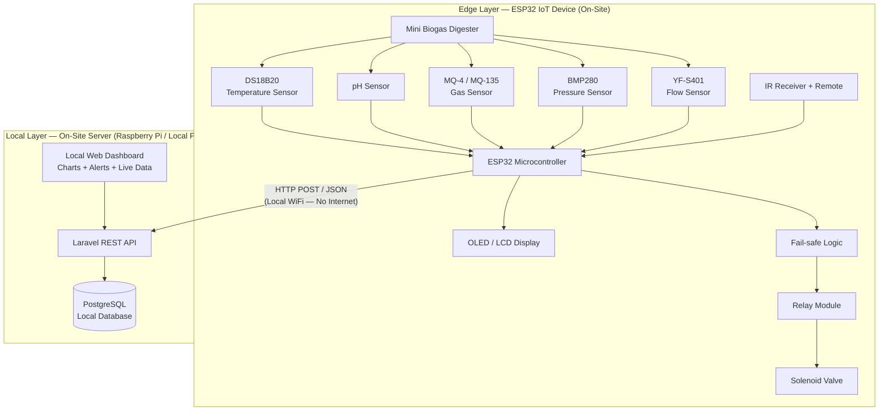
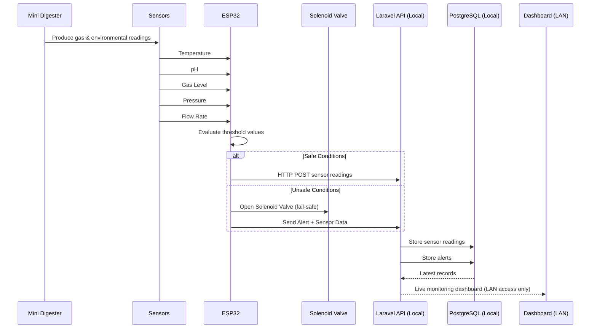
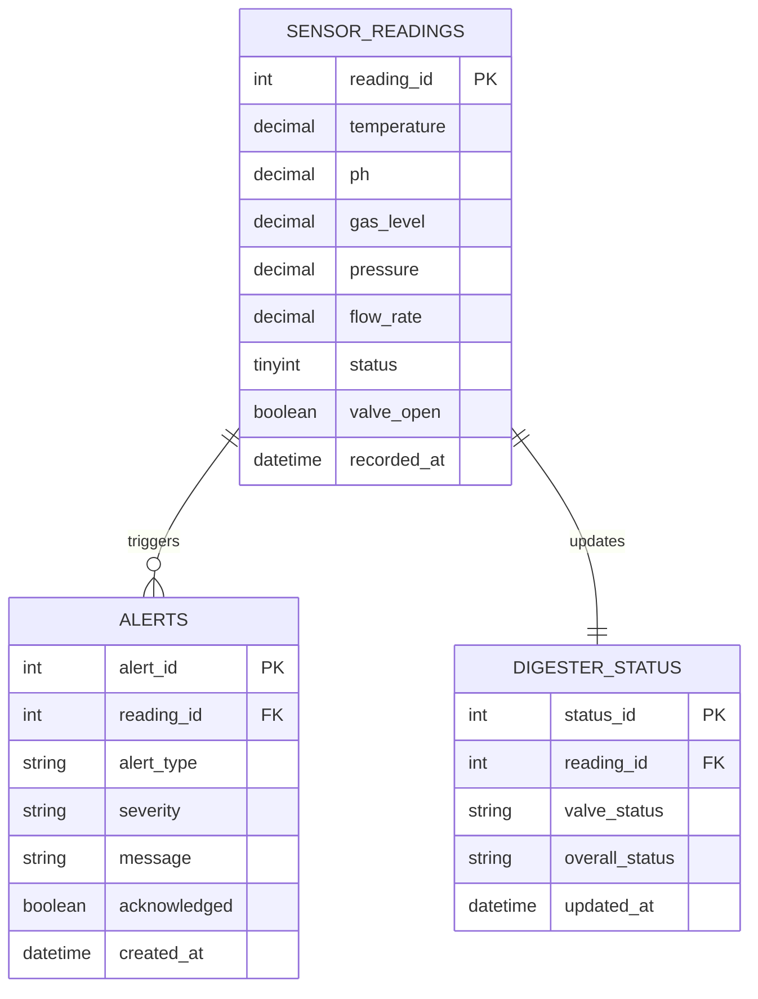

# System Architecture — SULO (Smart Utility for Local Organic Waste)

## Local-Only Mode — No Internet Required

SULO operates entirely on a local WiFi network. The ESP32 communicates with a local server (Raspberry Pi or small PC) over LAN. All data stays on-site. No cloud services, no internet connection, no subscription fees.

**Trade-off (for Delimitation section):** Operators can only view the dashboard while physically on the same local network (e.g., inside the karenderya). Off-site/remote access is not available without adding VPN or port-forwarding.

---

## 1. Architecture Overview



---

## 2. Sensor Data Flow — Step-by-Step



### Operating Procedure

| Step | Action | Description |
|------|--------|-------------|
| 1 | **System Init** | ESP32 powers up, initialises all sensors, connects to local WiFi, connects to local Laravel server. |
| 2 | **Sensor Polling** | Every 10 seconds, ESP32 reads all sensor values. |
| 3 | **Threshold Evaluation** | Firmware compares each reading against safe ranges (temp 25-55C, pH 6.0-8.5, pressure <=200 kPa, gas <=5000 ppm). |
| 4 | **Display Update** | OLED/LCD refreshes with current values + status indicator (Normal/Warning/Critical). |
| 5 | **Data Transmission** | ESP32 sends JSON via HTTP POST to local Laravel API over WiFi LAN. |
| 6 | **Fail-Safe Trigger** | On critical overpressure, ESP32 actuates solenoid valve relay immediately. |
| 7 | **IR Remote** | Operator uses handheld remote to navigate display screens, silence alerts. |
| 8 | **Local Dashboard** | Any device on the same WiFi can open http://192.168.4.1:8000 to view live data, charts, and alerts. |
| 9 | **Alert Notification** | Both LCD and dashboard immediately reflect any threshold breach. |
| 10 | **Continuous Loop** | Steps 2-9 repeat for as long as the system is powered. |

---

## 3. Database Design (ER Diagram)



---

## 4. Network Topology

```
+-----------------------------------------------------+
|                 Local WiFi Network (LAN)            |
|                  No Internet Required                |
|                                                     |
|   +----------+    HTTP POST     +----------------+  |
|   |  ESP32   | ------------->  |  Raspberry Pi  |  |
|   |  (Edge)  |                  |  (Local Server)|  |
|   +----------+                  |                |  |
|        ^                        |  Laravel API   |  |
|   Sensors +                    |  PostgreSQL    |  |
|   Display +                    |  Web Dashboard |  |
|   Valve +                      +----------------+  |
|   IR Remote                         ^               |
|                                 Dashboard            |
|                              (any LAN device)        |
+-----------------------------------------------------+
```

---

## 5. Directory Structure

```
Project-SULO/
├── firmware/                          # ESP32 Arduino/PlatformIO code
│   ├── ESP32.ino                      # Main sketch (setup + loop)
│   ├── config.h                       # WiFi, pins, thresholds
│   ├── sensors.h / sensors.cpp        # Sensor reading + threshold eval
│   ├── display.h / display.cpp        # OLED display with multi-screen
│   ├── wifi.h / wifi.cpp              # WiFi + HTTP POST to local API
│   ├── failsafe.h / failsafe.cpp      # Solenoid valve fail-safe
│   └── platformio.ini                 # PlatformIO project config
│
├── backend/                           # Laravel (runs on Raspberry Pi)
│   ├── app/Http/Controllers/
│   ├── app/Models/
│   ├── routes/
│   ├── resources/views/               # Dashboard Blade template
│   ├── database/migrations/
│   ├── composer.json
│   └── .env.example
│
├── scripts/
│   └── setup-rpi.sh                   # Raspberry Pi setup script
│
├── documentation/
│   ├── SYSTEM_ARCHITECTURE.MD         # This file
│   └── SETUP_GUIDE.md                 # Deployment guide
│
├── README.md
└── LICENSE
```

---

## 6. Hardware Bill of Materials

| Component | Model | Purpose |
|-----------|-------|---------|
| Microcontroller | ESP32 DevKit | Edge processor, WiFi, sensor I/O |
| Temperature Sensor | DS18B20 | Digester temperature monitoring |
| pH Sensor | pH Sensor Kit (BNC) | Acid-alkaline balance |
| Gas Sensor | MQ-4 / MQ-135 | Methane / biogas detection |
| Pressure Sensor | BMP280 | Digester internal pressure |
| Flow Sensor | YF-S401 | Gas output flow rate |
| Display | SSD1306 OLED (128x64) | On-site status display |
| IR Receiver | VS1838B + Remote | Operator screen navigation |
| Relay Module | 5V 1-channel | Solenoid valve control |
| Solenoid Valve | 12V normally-closed | Overpressure relief |
| Server | Raspberry Pi 4/5 (or local PC) | Laravel + PostgreSQL host |

---

## 7. API Endpoints

| Method | Endpoint | Description |
|--------|----------|-------------|
| POST | /api/readings | ESP32 sends sensor data |
| POST | /api/alerts | ESP32 sends alert event |
| GET | /api/readings | Dashboard: paginated readings |
| GET | /api/readings/latest | Dashboard: most recent reading |
| GET | /api/readings/history?hours=24 | Dashboard: hourly averages for charts |
| GET | /api/alerts | Dashboard: alert log |
| PATCH | /api/alerts/{id}/acknowledge | Mark alert acknowledged |
| GET | /api/status | Dashboard: current digester status |
| DELETE | /api/readings/prune?days=90 | Maintenance: remove old data |

---

## 8. Threshold Configuration

| Parameter | Normal Range | Warning | Critical | Action |
|-----------|-------------|---------|----------|--------|
| Temperatu
