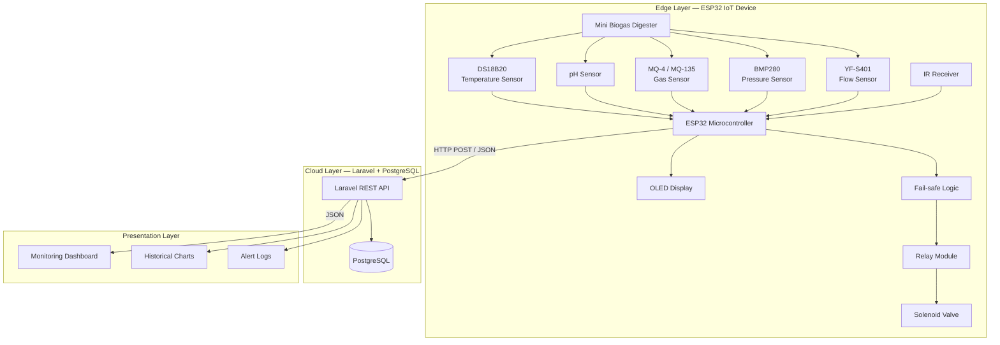
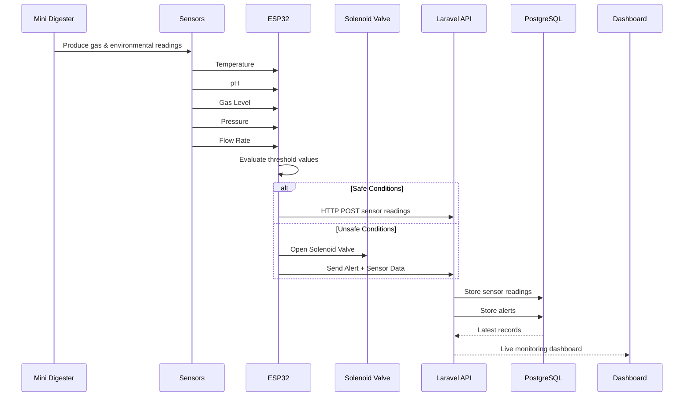
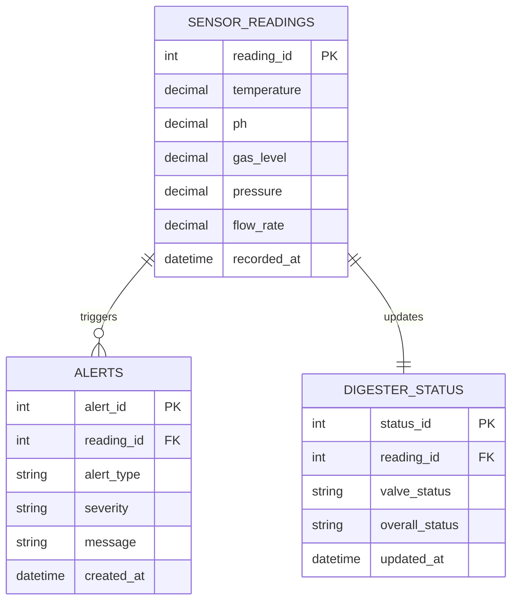

# System Architecture — SULO (Smart Utility for Local Organic Waste)

## 1. Architecture Overview

## 2. Sensor Data Flow

## 3. Database Design (ER Diagram)

Project-SULO/

│

├── firmware/
│   ├── ESP32.ino
│   ├── sensors.cpp
│   ├── display.cpp
│   ├── wifi.cpp
│   ├── failsafe.cpp
│   └── config.h
│

├── backend/
│   ├── app/
│   │   ├── Http/
│   │   │   └── Controllers/
│   │   │        ├── SensorController.php
│   │   │        ├── AlertController.php
│   │   │        └── DashboardController.php
│   │   │
│   │   └── Models/
│   │        ├── SensorReading.php
│   │        ├── Alert.php
│   │        └── DigesterStatus.php
│   │
│   ├── routes/
│   │     api.php
│   │
│   └── database/
│         migrations/
│

├── frontend/
│   ├── Dashboard
│   ├── Live Monitoring
│   ├── Historical Charts
│   └── Alert History
│

├── documentation/
│

├── README.md
│
└── LICENSE