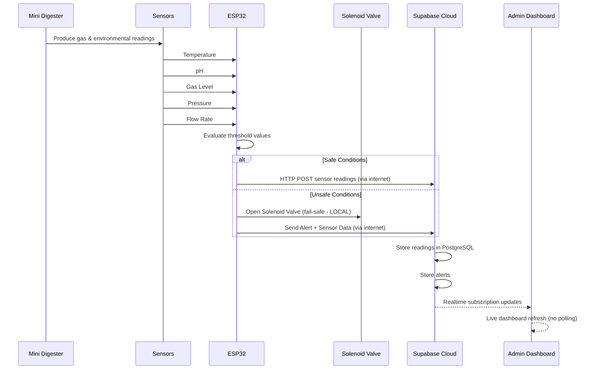
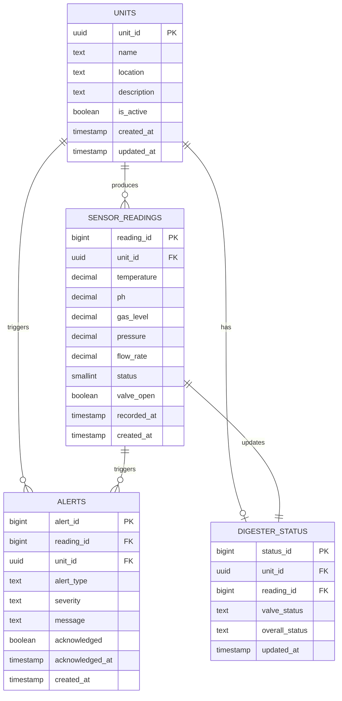

# System Architecture — SULO (Smart Utility for Local Organic Waste)

## Cloud-Based Mode — Internet Required

SULO operates using a cloud-based architecture. The ESP32 communicates directly with Supabase (cloud PostgreSQL) via the internet. Data is stored securely in the cloud. The admin dashboard can be accessed from anywhere with internet connectivity.

---

## 1. Architecture Overview

```
┌─────────────────────────────────────────────────────────────────────────────┐
│                           HARDWARE LAYER (On-Site)                          │
│                                                                             │
│   ┌─────────────────────────────────────────────────────────────────────┐  │
│   │                     Biogas Digester Unit                            │  │
│   │                                                                     │  │
│   │   ┌──────────┐ ┌──────────┐ ┌──────────┐ ┌──────────┐ ┌────────┐ │  │
│   │   │ DS18B20  │ │ pH       │ │ MQ-4     │ │ BMP280   │ │ YF-S401│ │  │
│   │   │ Temp     │ │ Sensor   │ │ Gas      │ │ Pressure │ │ Flow   │ │  │
│   │   └────┬─────┘ └────┬─────┘ └────┬─────┘ └────┬─────┘ └───┬────┘ │  │
│   │        │            │            │            │            │      │  │
│   │        └────────────┴────────────┴─────┬──────┴────────────┘      │  │
│   │                                        │                          │  │
│   │                                        ▼                          │  │
│   │                              ┌─────────────────┐                  │  │
│   │                              │   ESP32 DevKit   │                  │  │
│   │                              │   (Edge Device)  │                  │  │
│   │                              └────────┬────────┘                  │  │
│   │                                       │                           │  │
│   │                    ┌──────────────────┼──────────────────┐        │  │
│   │                    ▼                  ▼                  ▼        │  │
│   │            ┌──────────────┐   ┌──────────────┐   ┌────────────┐  │  │
│   │            │ SSD1306 OLED │   │ Relay Module │   │ IR Receiver│  │  │
│   │            │ (Display)    │   │ (Valve Ctrl) │   │ (Remote)   │  │  │
│   │            └──────────────┘   └──────┬───────┘   └────────────┘  │  │
│   │                                       │                          │  │
│   │                                       ▼                          │  │
│   │                              ┌─────────────────┐                  │  │
│   │                              │ Solenoid Valve   │                  │  │
│   │                              │ (12V NC)         │                  │  │
│   │                              │ Overpressure     │                  │  │
│   │                              │ Fail-safe        │                  │  │
│   │                              └─────────────────┘                  │  │
│   └─────────────────────────────────────────────────────────────────────┘  │
└──────────────────────────────────────────┬──────────────────────────────────┘
                                          │
                                          │ WiFi (Internet)
                                          │
                                          ▼
┌─────────────────────────────────────────────────────────────────────────────┐
│                           CLOUD LAYER (Supabase)                            │
│                                                                             │
│   ┌─────────────────────────────────────────────────────────────────────┐  │
│   │                         Supabase Platform                          │  │
│   │                                                                     │  │
│   │   ┌──────────────┐   ┌──────────────┐   ┌──────────────────┐      │  │
│   │   │  PostgreSQL  │   │    Auth      │   │    Realtime      │      │  │
│   │   │  Database    │   │   Service    │   │   Subscriptions  │      │  │
│   │   │              │   │              │   │                  │      │  │
│   │   │ • units      │   │ • Login      │   │ • Live updates   │      │  │
│   │   │ • readings   │   │ • Sessions   │   │ • Auto-refresh   │      │  │
│   │   │ • alerts     │   │ • RLS        │   │ • No polling     │      │  │
│   │   │ • status     │   │              │   │                  │      │  │
│   │   └──────┬───────┘   └──────┬───────┘   └────────┬─────────┘      │  │
│   │          │                  │                     │                │  │
│   │          └──────────────────┴─────────────────────┘                │  │
│   └─────────────────────────────────────┬─────────────────────────────┘  │
└──────────────────────────────────────────┼──────────────────────────────────┘
                                          │
                                          │ Internet
                                          ▼
┌─────────────────────────────────────────────────────────────────────────────┐
│                           SOFTWARE LAYER (Dashboard)                         │
│                                                                             │
│   ┌─────────────────────────────────────────────────────────────────────┐  │
│   │                      Admin Dashboard (Web App)                     │  │
│   │                                                                     │  │
│   │   • Login with email/password (Supabase Auth)                      │  │
│   │   • View all digester units                                        │  │
│   │   • Real-time sensor data (temperature, pH, gas, pressure, flow)   │  │
│   │   • Live charts (24h history)                                      │  │
│   │   • Alert notifications (warning/critical)                         │  │
│   │   • Acknowledge alerts                                             │  │
│   │   • Accessible from any device with internet                       │  │
│   └─────────────────────────────────────────────────────────────────────┘  │
│                                                                             │
└─────────────────────────────────────────────────────────────────────────────┘
```

---

## 2. Sensor Data Flow — Step-by-Step



### Operating Procedure

| Step | Action | Description |
|------|--------|-------------|
| 1 | **System Init** | ESP32 powers up, initialises all sensors, connects to WiFi with internet access. |
| 2 | **Sensor Polling** | Every 10 seconds, ESP32 reads all sensor values. |
| 3 | **Threshold Evaluation** | Firmware compares each reading against safe ranges (temp 25-55°C, pH 6.0-8.5, pressure ≤200 kPa, gas ≤5000 ppm). |
| 4 | **Display Update** | OLED/LCD refreshes with current values + status indicator (Normal/Warning/Critical). |
| 5 | **Data Transmission** | ESP32 sends JSON via HTTP POST to Supabase cloud REST API via internet. |
| 6 | **Cloud Storage** | Supabase PostgreSQL stores reading with unit_id for multi-unit support. |
| 7 | **Fail-Safe Trigger** | On critical overpressure, ESP32 actuates solenoid valve relay immediately (local operation). |
| 8 | **IR Remote** | Operator uses handheld remote to navigate display screens, silence alerts. |
| 9 | **Admin Dashboard** | Admin logs in from any device with internet, views live data, charts, alerts. |
| 10 | **Real-time Updates** | Dashboard updates automatically via Supabase Realtime subscriptions (no page refresh). |
| 11 | **Alert Notification** | Threshold breaches trigger alerts visible on dashboard immediately. |
| 12 | **Continuous Loop** | Steps 2-11 repeat for as long as the system is powered. |

---

## 3. Database Design (ER Diagram)



---

## 4. Network Topology

```
┌─────────────────────────────────────────────────────────────────────────────┐
│                              ON-SITE (Biogas Digester)                      │
│                                                                             │
│   ┌─────────────────────────────────────────────────────────────────────┐  │
│   │                                                                     │  │
│   │   DS18B20 ──┐                                                      │  │
│   │   pH ───────┤                                                      │  │
│   │   MQ-4 ─────┼──▶ ESP32 DevKit ──▶ OLED Display                    │  │
│   │   BMP280 ───┤         │                                            │  │
│   │   YF-S401 ──┘         ├──▶ Relay ──▶ Solenoid Valve                │  │
│   │                        │                                            │  │
│   │                        ▼                                            │  │
│   │                  WiFi Antenna                                       │  │
│   └─────────────────────────┬───────────────────────────────────────────┘  │
│                             │                                              │
└─────────────────────────────┼──────────────────────────────────────────────┘
                              │
                              │ Internet (HTTPS)
                              │
                              ▼
┌─────────────────────────────────────────────────────────────────────────────┐
│                              CLOUD (Supabase)                               │
│                                                                             │
│   ┌─────────────────────────────────────────────────────────────────────┐  │
│   │                                                                     │  │
│   │   REST API ──▶ PostgreSQL Database                                 │  │
│   │                    │                                               │  │
│   │                    ▼                                               │  │
│   │              Realtime Engine ──▶ WebSocket ──▶ Admin Dashboard     │  │
│   │                                                                     │  │
│   └─────────────────────────────────────────────────────────────────────┘  │
│                                                                             │
└─────────────────────────────────────────────────────────────────────────────┘
```

---

## 5. Directory Structure

```
Project-SULO/
├── firmware/                 # ESP32 Arduino/PlatformIO code
│   ├── ESP32.ino             # Main sketch (setup + loop)
│   ├── config.h              # WiFi, Supabase, pins, thresholds
│   ├── sensors.h / sensors.cpp  # Sensor reading + threshold eval
│   ├── display.h / display.cpp  # OLED multi-screen display
│   ├── wifi.h / wifi.cpp     # WiFi + HTTP POST to Supabase cloud
│   ├── failsafe.h / failsafe.cpp  # Solenoid valve fail-safe
│   └── platformio.ini        # PlatformIO project config
│
├── database/                 # Cloud database schema
│   └── supabase-schema.sql   # Supabase PostgreSQL schema (multi-unit)
│
├── admin/                    # Admin dashboard (static HTML)
│   └── index.html            # Login + multi-unit monitoring
│
├── prototype/                # Standalone demo (no backend needed)
│   ├── index.html            # Dashboard prototype with simulated data
│   └── esp32-simulator.html  # ESP32 serial monitor simulator
│
├── documentation/
│   ├── SYSTEM_ARCHITECTURE.MD  # This file
│   └── SULO_MANUAL.md         # User manual
│
├── CLOUD_SETUP.md            # Step-by-step cloud deployment guide
├── README.md
└── LICENSE
```

---

## 6. Hardware Bill of Materials

| Component | Model | Purpose |
|-----------|-------|---------|
| Microcontroller | ESP32 DevKit | Edge processor, WiFi, sensor I/O |
| Temperature Sensor | DS18B20 | Digester temperature monitoring |
| pH Sensor | pH Sensor Kit (BNC) | Acid-alkaline balance |
| Gas Sensor | MQ-4 / MQ-135 | Methane / biogas detection |
| Pressure Sensor | BMP280 | Digester internal pressure |
| Flow Sensor | YF-S401 | Gas output flow rate |
| Display | SSD1306 OLED (128x64) | On-site status display |
| IR Receiver | VS1838B + Remote | Operator screen navigation |
| Relay Module | 5V 1-channel | Solenoid valve control |
| Solenoid Valve | 12V normally-closed | Overpressure relief |
| ~~Server~~ | ~~Raspberry Pi~~ | ~~No longer needed (cloud DB)~~ |

---

## 7. Supabase REST API Endpoints

The ESP32 uses Supabase REST API (auto-generated from PostgreSQL schema):

| Method | Endpoint | Description |
|--------|----------|-------------|
| POST | `/rest/v1/sensor_readings` | ESP32 sends sensor data |
| POST | `/rest/v1/alerts` | ESP32 sends alert event |
| GET | `/rest/v1/sensor_readings` | Dashboard: query readings |
| GET | `/rest/v1/alerts` | Dashboard: query alerts |
| GET | `/rest/v1/units` | Dashboard: list all units |
| GET | `/rest/v1/digester_status` | Dashboard: current status |

**Authentication:** All requests include `apikey` and `Authorization` headers with the Supabase anon key.

---

## 8. Threshold Configuration

| Parameter | Normal Range | Warning | Critical | Action |
|-----------|-------------|---------|----------|--------|
| Temperature | 25–55 °C | ±5 °C of edge | Outside range | Alert |
| pH | 6.0–8.5 | ±0.3 of edge | Outside range | Alert |
| Gas Level | 0–5000 ppm | >4500 ppm | >5000 ppm | Alert |
| Pressure | 0–180 kPa | 180–200 kPa | >200 kPa | **Open valve** |

---

## 9. Security Considerations

| Layer | Implementation |
|-------|----------------|
| **Data in Transit** | HTTPS (Supabase provides SSL by default) |
| **Authentication** | Supabase Auth (email/password, JWT tokens) |
| **Authorization** | Row Level Security (RLS) policies |
| **API Access** | Anon key for public read, service role for writes |
| **ESP32 Auth** | Anon key embedded in firmware (read-only access) |

---

## 10. Deployment Options

| Component | Free Tier | Paid Tier |
|-----------|-----------|-----------|
| **Supabase Database** | $0/month (500 MB) | $25/month (8 GB) |
| **Admin Dashboard Hosting** | $0 (Vercel/Netlify) | $20/month (custom domain) |
| **ESP32 + Sensors** | N/A (one-time hardware) | ~₱3,000-5,000 |
| **Total** | **₱0/month** + hardware | **$45/month** + hardware |

---

**Last Updated:** September 2026
**Architecture Version:** 2.0 (Cloud-Based)
